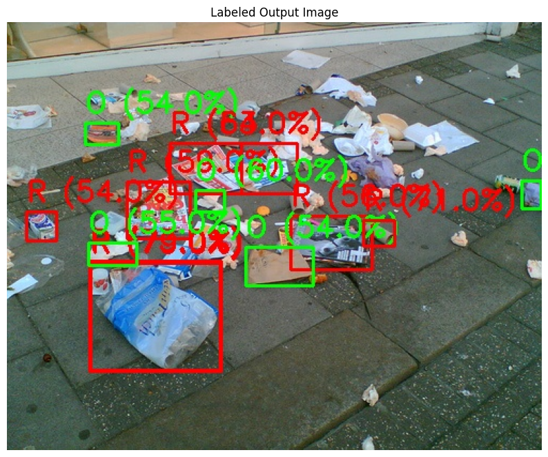
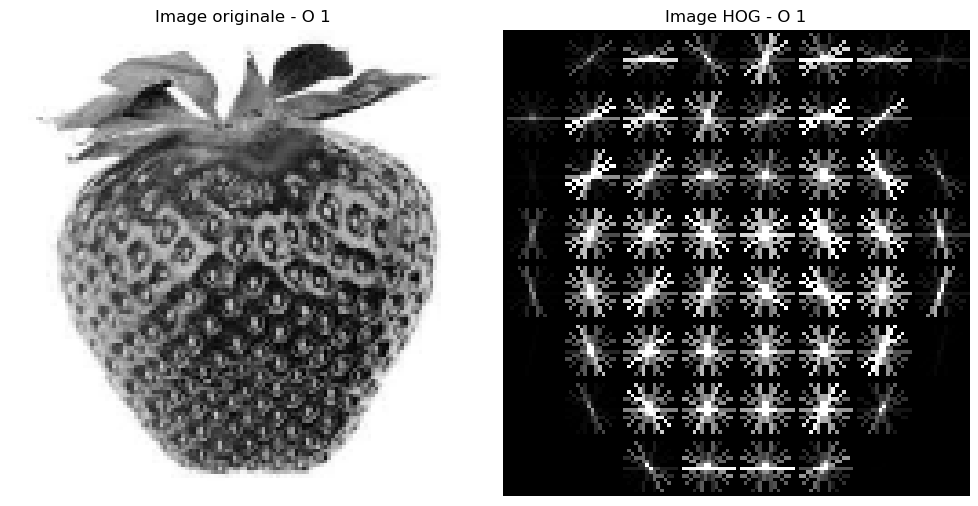
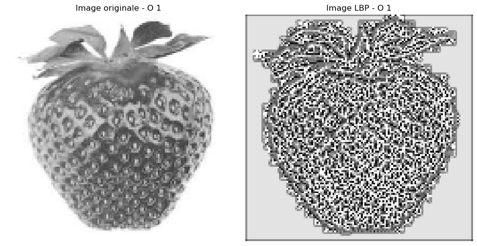

# ♻️ Système Intelligent pour la Classification et le Recyclage des Déchets



### 📄 Description du Projet
Ce projet développe un système de classification automatique des déchets pour optimiser leur recyclage. L'objectif est d'exploiter des techniques avancées de traitement d'images et d'apprentissage automatique pour identifier et classer différents types de déchets.

### 🎯 Objectifs
- 🚀 Automatiser la classification des déchets en combinant des techniques classiques et des modèles avancés de machine learning et deep learning.
- 📈 Identifier les meilleures combinaisons de méthodes d'extraction de caractéristiques et de modèles pour une classification précise.
- 🔍 Développer un pipeline complet intégrant segmentation, classification et évaluation.

### 🗂️ Organisation des Notebooks
- **🛠️ Partie 1 :** Classification avec des descripteurs Hand-crafted
  1. **🔍 Extraction de caractéristiques :** Utilisation de HOG et LBP.
  2. **🧠 Entraînement :** Modèles SVM, Random Forest, XGBoost et KNN.
  3. **📊 Évaluation :** Comparaison des performances.

- **🤖 Partie 2 :** Classification avec des descripteurs de haut niveau
  1. **🖼️ Extraction de caractéristiques :** Modèles avancés (ResNet, Vision Transformer - ViT).
  2. **🧠 Entraînement :** Modèles Random Forest, Gradient Boosting.
  3. **🏆 Classement final :**
     - **Transformer + Random Forest :** Accuracy 0.973
     - **Transformer + Gradient Boosting :** Accuracy 0.970
     - **ResNet + Gradient Boosting :** Accuracy 0.960

- **🔬 Partie 3 :** Détection, segmentation et classification des déchets
  1. **📸 Collecte et préparation des données :** Acquisition d'images diverses.
  2. **✂️ Segmentation :** Méthodes avancées pour isoler les déchets.
  3. **🧪 Classification :** Application du modèle ViT + Random Forest pour des performances optimales.

### ⚙️ Prérequis
Le projet a été réalisé sur Google Colab.
- 🐍 Python 3.8+
- 📸 OpenCV
- 🔬 Scikit-learn
- 🔍 TensorFlow / PyTorch
- 📊 Matplotlib
- 🔢 Numpy
- 🖼️ Scikit-image

**Dataset pour partie 1 et 2 :**
- https://drive.google.com/file/d/1PGDCtez3_pDoPUMr_YacJFTfhdRn2jnD/view?usp=drive_link


### 🛠️ Installation
```bash
# Clone du projet
git clone https://github.com/Dhia-69/classification-dechets.git
cd classification-dechets
```

### 🚀 Utilisation

1. 📂 Lancer les notebooks dans l'ordre (Partie 1, 2, puis 3).
2. 🛠️ Adapter les chemins vers les datasets si nécessaire.
3. 🧪 Exécuter chaque section pour extraire les caractéristiques, entraîner les modèles et évaluer les performances.

### 📊 Visualisations
- **Caractéristiques extraites par HOG**
  

- **Caractéristiques extraites par LBP**
  

### 📊 Résultats
- **Meilleures Performances :**
  - Transformer + Random Forest : Accuracy **0.973**
  - Transformer + Gradient Boosting : Accuracy **0.970**
  - ResNet + Gradient Boosting : Accuracy **0.960**

### 🌳 Racine du Projet
Le projet est organisé comme suit :

```plaintext
Système intelligent pour la classification et le recyclage des déchets
├── images/
│   ├── image.png
│   ├── hog.png
│   ├── LBP.png
├── g_dechets.zip
├── Partie1.ipynb
├── Partie2.ipynb
├── Partie3.ipynb
├── ViT.ipynb
├── présentation.pdf
├── README.md
```

### 🔮 Améliorations Futures
- 🔧 Intégration de modèles de segmentation plus performants.
- 📸 Augmentation du dataset pour améliorer la robustesse.
- 📱 Déploiement du modèle sous forme d'application web ou mobile.

---
### 👨‍💻 Auteurs

- 🧑‍💻 **Dhia Elhak Toukebri** (dhiatoukebri@gmail.com)
- 🧑‍💻 **Kammoun Med Habib** (haboubkammoun13@gmail.com)
